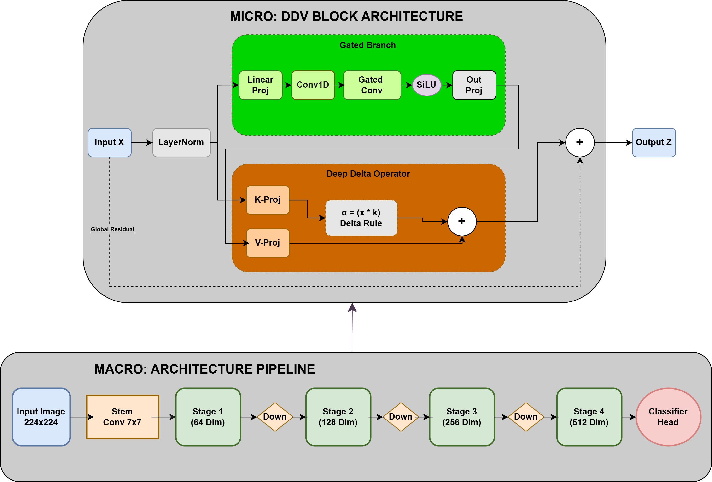
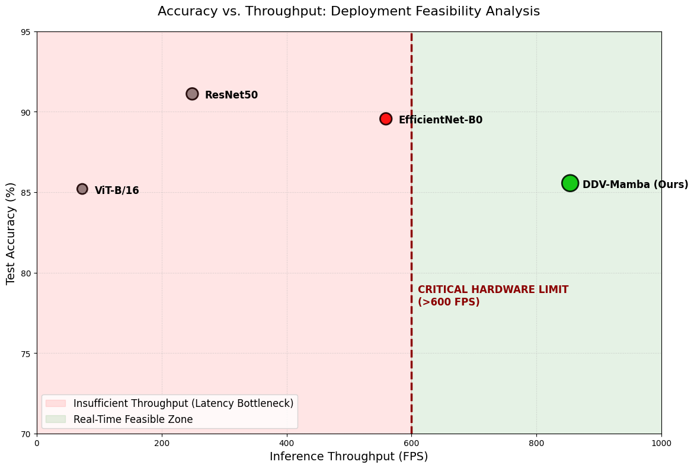
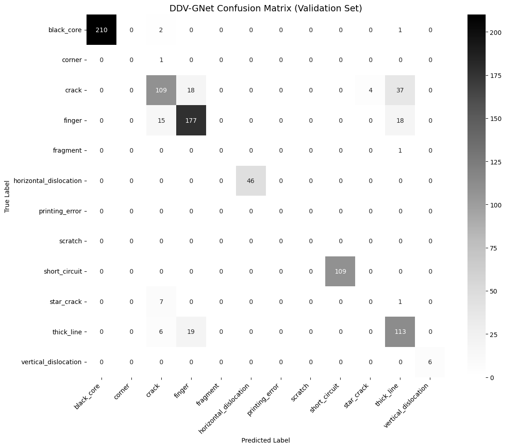

# DDV-GNet: High-Throughput Defect Detection for Space Manufacturing
[](#)
[](#)
[](https://opensource.org/licenses/MIT)

> **Official PyTorch Implementation of the paper:** *"DDV-GNet: High-Throughput Defect Detection for Space Manufacturing via Deep Delta Gated Networks"* 

## TL;DR
Real-time defect detection in aerospace manufacturing requires processing speeds exceeding **600 Frames Per Second (FPS)**. Traditional models like ResNet-50 and Vision Transformers (ViTs) fail to meet this threshold without sacrificing accuracy. 

**DDV-GNet** is a novel hierarchical gated convolutional architecture that solves this bottleneck. By integrating **Deep Delta Operators** with linear-complexity feature gating, DDV-GNet achieves **87.91% accuracy at a blistering 853.94 FPS** on an NVIDIA T4 GPU, making it the premier choice for synchronized satellite component production lines.

---

##  Key Features
* **Unmatched Speed:** Processes images at **853.94 FPS** with a latency of just **1.17 ms**, comfortably beating the 600 FPS industrial requirement.
* **Deep Delta Gated Architecture:** Utilizes gated linear transformations and multiplicative delta rules instead of computationally heavy self-attention mechanisms.
* **Domain-Specific Transfer Learning:** Pre-trained on the **EuroSAT** satellite imagery dataset, leveraging unique textual patterns (river/highway grids) that map perfectly to solar panel busbars and micro-cracks.
* **Lightweight & Edge-Ready:** Achieves highly competitive accuracy with only **7.18M parameters** ($O(N)$ linear complexity).

---

##  Architecture

DDV-GNet features a four-stage hierarchical pipeline (64 → 128 → 256 → 512 dimensions) for multi-scale feature extraction. The core `DDV Block` utilizes a Gated Convolutional Branch paired with a Deep Delta Operator to ensure optimal gradient flow and data-dependent feature filtering.


*(Figure 1: Macro pipeline and Micro DDV block architecture featuring Gated Convolutions and Deep Delta Multiplicative rules).*

---

## Results & Performance 

We evaluated DDV-GNet on the **PVEL-AD Dataset** (12 classes of solar panel defects) against industry-standard efficient architectures.

### Performance Comparison (NVIDIA T4 GPU)

| Model | Accuracy (%) | Parameters (M) | Throughput (FPS) | Latency (ms) |
| :--- | :---: | :---: | :---: | :---: |
| ResNet-50 | 90.11 | 23.53 | 249.00 | 4.02 |
| EfficientNet-B0 | 89.31 | 4.02 | 559.00 | 1.79 |
| ViT-B/16 | 85.20 | 85.81 | 73.00 | 13.70 |
| **DDV-GNet (Ours)** | **87.91** | **7.18** | **853.94** | **1.17** |

### Deployment Feasibility

DDV-GNet is the **only** model tested that successfully lands in the "Real-Time Feasible Zone" for industrial aerospace sorting machines.

<p align="center">
  
  
</p>

---

## Quick Start & Installation

### 1. Clone the Repository
```
git clone [https://github.com/Latchan-Ch/DDV-GNet-Space.git](https://github.com/Latchan-Ch/DDV-GNet-Space.git)
cd DDV-GNet-Space
2. Install Dependencies
3. Download the Dataset
The PVEL-AD dataset is publicly available on Kaggle. Download it and extract it to the data/ directory.
 PVEL-AD Dataset on Kaggle(https://www.kaggle.com/datasets/programmer3/pvel-ad-electroluminescence-pv-defect-dataset)
4. Run Training
5. Evaluate
```
## Citation
If you find this code or our paper useful in your research, please consider citing:
Code snippet
@inproceedings{chhetri2026ddvgnet,
  title={DDV-GNet: High-Throughput Defect Detection for Space Manufacturing via Deep Delta Gated Networks},
  author={Chhetri, Latchan and Kumar, Aman},
  booktitle={2026 IEEE Space, Aerospace and Defence Conference (SPACE)},
  year={2026},
  organization={IEEE}
}
